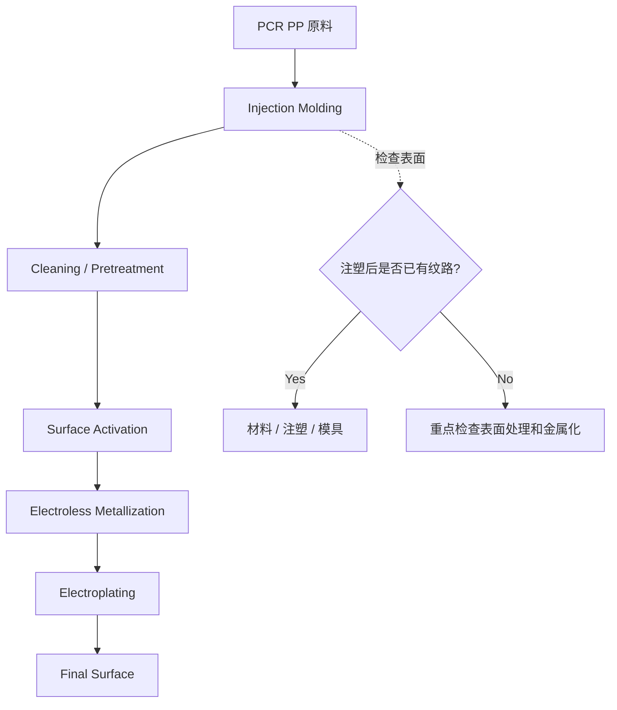
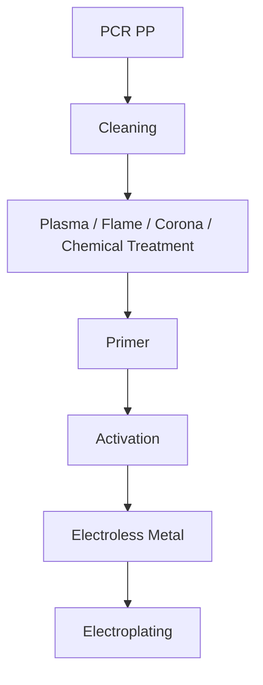
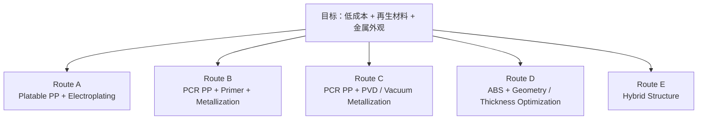

> **[[engineering-case-notes/index|Engineering Case Notes]] · Case 001**  
> 当材料替代、注塑工艺、原有模具和表面处理同时变化时，真正困难的不是列出更多可能原因，而是设计一个足够小、却能快速减少不确定性的实验。

---

## 1. 问题背景

很多材料替代项目在实验室层面看起来很简单：

**找到一个价格更低、碳足迹更低，或者再生含量更高的材料，然后替换现有材料。**

但一旦进入真实制造系统，材料变化往往会同时改变：

- 流变行为
- 冷却与结晶
- 收缩
- 表面质量
- 模具工艺窗口
- 后续表面处理
- 良率与返工成本

这个案例就是一个典型例子。

某类产品原本使用 **ABS 注塑件 + 装饰性电镀**。为了降低材料成本，同时提高再生材料使用比例，希望尝试使用 **PCR PP** 替代 ABS。

试产后出现了一个明显问题：

> **PCR PP 零件完成电镀后，表面出现明显纹路，外观质量无法达到原 ABS 产品水平。**

第一眼看起来，这似乎只是一个塑料电镀问题。

但如果进一步拆解，会发现至少有四个系统同时可能参与其中：

真正需要解决的问题因此不是：

> 为什么 PCR PP 表面有纹路？

而是：

> **这个缺陷首先在哪一个环节产生？什么因素在放大它？以及是否存在一条技术和经济上都更合理的路线？**

---

## 2. 第一个直觉：是不是原来的 ABS 模具出了问题？

看到这个问题时，我的第一反应是：

ABS 和 PP 在收缩率、结晶行为、PVT 特性以及流变行为上存在明显差异。

如果供应商直接使用原本针对 ABS 优化的模具生产 PCR PP，那么模具与新材料之间的匹配可能存在问题。

这个假设有一定合理性。

从 ABS 切换到 PP 后，可能同时发生：

- 熔体黏度变化
- 结晶行为变化
- 体积收缩变化
- 表层冻结速度变化
- 保压响应变化
- 冷却敏感性变化
- 翘曲倾向变化

原来针对 ABS 优化的：

**Gate / Runner / Venting / Cooling / Packing**

并不一定适用于 PP。

但继续往下推理，会发现一个问题：

**材料收缩率不同，本身并不能直接解释所有类型的表面纹路。**

如果问题主要来自尺寸收缩，通常更容易表现为：

- dimensional deviation
- warpage
- sink mark
- local depression
- packing sensitivity

如果观察到的是明显沿熔体流动方向分布的纹路，则还应该考虑：

- flow instability
- volatile contamination
- gas generation
- shear history
- venting
- surface replication
- metallization amplification

因此，这个假设需要被重新定义。

不是：

> **ABS 模具不能用于 PP。**

而是：

> **原 ABS 模具可能使 PCR PP 工作在一个非最优的填充、排气、保压和冷却窗口中。**

这两个说法看起来相近，但后者更容易被实验验证。

---

## 3. 不要先问 Why，先问 Where

复杂 failure analysis 中，一个常见错误是一开始就问：

> 为什么会出现这个问题？

但在这个案例里，我认为更有价值的第一个问题是：

> **缺陷在哪一道工序第一次出现？**

整个过程可以简化为：

这一步可以迅速把问题分成三个方向。

### 情况 A：注塑后已经存在明显纹路

优先调查：

**Material + Injection Molding + Tooling**

### 情况 B：注塑后表面良好，电镀后才出现

优先调查：

**Pretreatment + Activation + Metallization**

### 情况 C：注塑后只有轻微纹路，电镀后明显放大

这种情况很可能意味着：

> **Injection defect × Metallization amplification**

这比一开始列出十几个潜在原因更有价值，因为它首先缩小了问题空间。

---

## 4. 把 root cause space 拆成四个系统

### 4.1 材料：PCR PP 是否足够稳定？

PCR PP 与 virgin PP 最大的区别，不只是它来自再生料。

对制造稳定性更重要的变量可能包括：

- Feedstock variation
- PE contamination
- Filler
- Pigment
- Residual ink
- Adhesive residue
- Additive package
- Thermal degradation products
- VOC
- MFR variation
- Molecular-weight distribution

对于普通结构件，一些微小波动也许可以接受。

但当最终表面需要高光或金属装饰效果时，这些变化可能被显著放大。

因此，一个很重要的问题是：

> **同一模具、同一工艺下，Virgin PP 和 PCR PP 的表现是否不同？**

如果 Virgin PP 表面良好，而 PCR PP 明显出现问题，那么材料本身的贡献就值得优先调查。

---

### 4.2 注塑：纹路是否与熔体流动有关？

如果纹路明显沿 flow direction 出现，则应该重点查看：

- Melt temperature
- Injection speed
- Mold temperature
- Holding pressure
- Holding time
- Flow length
- Gate location
- Venting

PCR 材料还有一个额外风险：

过高温度或过强剪切可能增加部分残余物、低分子组分或污染物的挥发与降解。

因此不能简单套用：

> 温度更高，表面一定更好。

或者：

> 注射更快，流痕一定更少。

真正需要找到的是：

**这个具体 PCR PP grade 的 process window。**

---

### 4.3 模具：不要只盯着 shrinkage

如果我要快速检查原 ABS 模具是否参与了问题，我不会先查 nominal shrinkage。

我更关心的是：

#### Gate

纹路是否从 gate 附近开始？

#### Flow path

纹路是否沿熔体流动方向发展？

#### End-of-fill

缺陷是否集中在填充末端？

#### Venting

缺陷是否出现在容易困气的位置？

#### Wall thickness

是否存在明显厚薄变化？

#### Cooling

是否存在明显的不对称冷却区域？

如果缺陷位置与这些几何和工艺特征存在稳定对应关系，那么 tooling contribution 的可能性才真正增加。

换句话说：

> **空间分布本身就是证据。**

---

### 4.4 电镀：PP 不是 ABS

这是整个案例中最容易被低估的部分。

ABS 是非常成熟的塑料电镀基材。

传统 ABS 电镀体系的表面处理，与 ABS 特定的材料结构和表面活化机制密切相关。

PP 则是低表面能、非极性的半结晶聚合物。

因此，即使 PCR PP 注塑后的表面看起来良好，也不能直接假设：

> 原有 ABS plating process 仍然适用。

真正应该向供应商追问的是：

> **所谓的 platable PCR PP，具体采用了什么表面处理路线？**

例如：

如果供应商只是替换了塑料，却基本沿用原 ABS 的前处理逻辑，那么风险可能并不在注塑本身。

---

## 5. 不要先做全面表征，先做一个高信息密度实验

面对这种问题，很容易马上想到：

SEM、FTIR、DSC、TGA、GC-MS、GPC……

这些方法当然都有价值。

但第一阶段，我不会立即做完整材料分析。

因为此时最关键的问题不是：

> PCR PP 的所有材料特征是什么？

而是：

> **哪个变量最值得下一步投入资源？**

我会优先做一个最小 screening：

| Sample | Material  | Processing      | Role           |
| ------ | --------- | --------------- | -------------- |
| A      | ABS       | 原 ABS 优化参数 | Reference      |
| B      | Virgin PP | PP 优化参数     | PP control     |
| C      | PCR PP    | PP 优化参数     | PCR effect     |
| D      | PCR PP    | 当前供应商参数  | Process effect |

所有样品都在两个阶段观察：

1. **Before plating**
2. **After plating**

除了肉眼观察，最好同时记录：

- defect position
- flow direction
- gate position
- weld line
- cavity
- roughness
- gloss
- microscopy image

---

## 6. 一个小实验可以回答什么？

### Scenario 1

**ABS：Good  
Virgin PP：Good  
PCR PP：Bad**

更值得调查：

> PCR feedstock / contamination / formulation

---

### Scenario 2

**ABS：Good  
Virgin PP：Bad  
PCR PP：Bad**

更值得调查：

> PP-specific molding / tooling compatibility

---

### Scenario 3

**Virgin PP 与 PCR PP 注塑后都很好，但电镀后变差**

优先调查：

> Surface treatment / metallization

---

### Scenario 4

**PCR PP 在供应商当前参数下表现较差，但在 PP 优化参数下明显改善**

优先调查：

> Processing window

---

## 7. 更重要的问题不是生成更多假设，而是区分假设

今天使用 AI，可以在几秒钟内生成很长的 root-cause list：

- 材料污染
- 模温
- 注射速度
- 浇口
- 保压
- 排气
- 收缩
- 表面能
- 镀层附着
- 前处理
- 金属沉积

但真正困难的部分并不是：

> **Hypothesis generation**

而是：

> **Hypothesis discrimination**

也就是说：

**怎样设计最少的实验，使错误的假设最快消失？**

真实工业环境中的实验永远受到限制：

- 材料有限
- 机器时间有限
- supplier resource 有限
- 项目时间有限
- 分析预算有限

因此，一个优秀实验的价值，并不取决于它产生多少数据。

而取决于：

> **一次实验能够消除多少不确定性。**

---

## 8. 再往上一层：客户真的想要 PCR PP 电镀吗？

到这里，还可以再问一个更根本的问题。

客户真正的目标到底是什么？

很可能并不是：

> **如何让 PCR PP 能够电镀？**

真正目标更可能是：

> **如何用更低成本、更高再生材料比例，实现稳定且有吸引力的金属外观？**

如果这样重新定义问题，技术路线就不再只有一条。

此时需要比较的已经不只是材料性能，而包括：

| Dimension          | Questions                          |
| ------------------ | ---------------------------------- |
| Cost               | €/kg 还是 €/good part？            |
| Appearance         | 能否稳定达到目标外观？             |
| Yield              | 量产良率是多少？                   |
| Investment         | 是否需要改模具、设备或表面处理线？ |
| CO₂                | 总系统碳足迹如何变化？             |
| Process complexity | 工艺是否明显变复杂？               |
| Recyclability      | 新的表面体系会不会影响后续回收？   |

问题因此从：

**Failure Analysis**

逐渐变成：

**Technology Route Selection**

---

## 9. 不要只比较 €/kg，要比较 €/good part

假设：

ABS 材料价格高于 PCR PP。

这并不意味着 PCR PP 一定是更便宜的零件路线。

真正的零件成本可以简化为：

$$
C_{good\ part}
=
\frac{
C_{material}
+
C_{molding}
+
C_{surface}
+
C_{plating}
+
C_{rework}
}{
Yield
}
$$

如果 PCR PP 带来了：

- 更高 reject rate
- 更复杂前处理
- 更低 plating yield
- 更长 cycle time
- 更多返工
- 更严格 batch control

那么材料单价下降，并不必然意味着最终产品成本下降。

因此，材料替代中一个非常重要的思维转变是：

> **从 €/kg 转向 €/good part。**

---

## 10. 这个案例给我的三个启发

### 10.1 材料替代不是单纯的材料属性替代

ABS → PCR PP 改变的不只是 polymer。

它同时改变：

**Material × Process × Tooling × Interface**

因此更准确地说，这是一次：

> **Manufacturing system change**

---

### 10.2 在复杂流程中，Where 往往应该先于 Why

首先确定：

> 缺陷第一次出现在哪里？

然后再讨论：

> 为什么出现？

这可以显著减少无效分析。

---

### 10.3 AI 时代，工程师的价值正在从生成答案转向设计证据

AI 已经非常擅长：

- 搜索知识
- 生成假设
- 总结文献
- 构建 root-cause list

但真实工程问题需要进一步完成：

也就是说：

> **不仅知道什么可能发生，更知道下一步最值得验证什么。**

---

## 11. 最后的思考

仅凭目前的信息，无法判断 PCR PP 是否最终能够成为这个应用中合适的 ABS 替代方案。

但工程问题并不要求一开始就知道答案。

真正重要的是：

**让每一次实验都减少不确定性。**

如果一个复杂问题可以不断被拆成：

**Problem → Hypothesis → Evidence → Experiment → Decision**

那么即使最开始没有答案，工程团队仍然可以持续逼近一个更可靠的决策。

对材料工程而言，这可能比拥有更多材料数据本身更加重要。

---

## 关于 Engineering Case Notes

[[engineering-case-notes/index|返回 Engineering Case Notes 栏目首页]]

**Engineering Case Notes** 是我整理真实材料与制造问题的一组思考记录。

我希望重点记录的不是标准答案，而是：

> **如何把一个模糊的工程问题，逐渐转化为一个可验证、可比较、可决策的问题。**

后续可能涉及：

- Materials Selection
- Recycling
- Injection Molding
- Surface Engineering
- Failure Analysis
- LCA
- Manufacturing
- Technology Strategy
- Material Intelligence

---

> **Disclaimer**  
> 本文为经过抽象和重构的工程案例，用于讨论通用的材料与制造问题诊断方法，不代表任何特定企业、供应商、产品或实际商业项目，也不包含任何非公开或保密信息。
